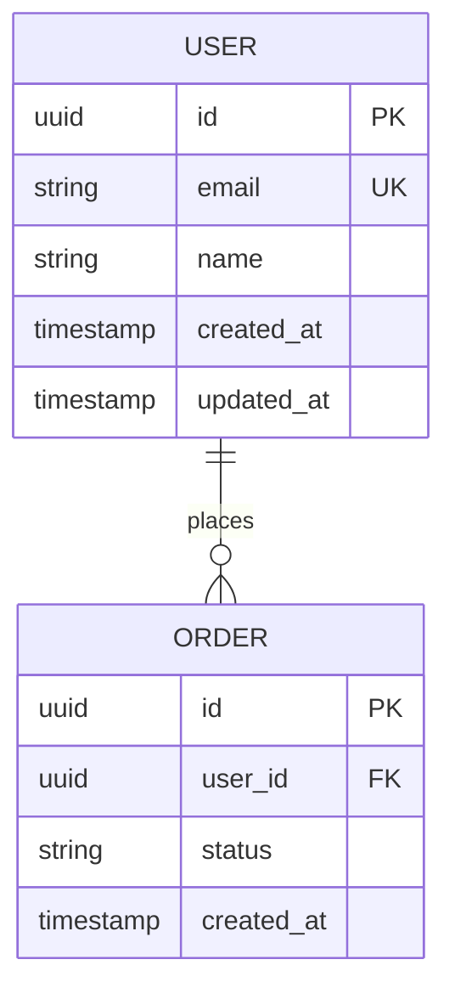

# System Design Patterns & Decision Frameworks

## Architecture Decision Framework

For each major decision, document using this format:
```
Decision: [what we're deciding]
Options: [A, B, C]
Chosen: [option]
Rationale: [why, what tradeoffs we accept]
Revisit if: [conditions that would invalidate this choice]
```

---

## Common Architecture Patterns

### API Design
| Pattern | Use When |
|---|---|
| REST | Standard CRUD, external-facing APIs, wide tooling support |
| GraphQL | Complex queries, multiple clients with different data needs |
| gRPC | Internal service-to-service, performance-critical, streaming |
| WebSocket | Real-time bidirectional (chat, live updates, collaborative) |

### Data Storage
| Pattern | Use When |
|---|---|
| PostgreSQL | Relational data, transactions, complex queries |
| MongoDB | Document-oriented, flexible schema, rapid iteration |
| Redis | Caching, sessions, pub/sub, rate limiting |
| S3/Blob | File storage, media, large binary objects |
| Elasticsearch | Full-text search, log aggregation |

### Service Patterns
| Pattern | Use When |
|---|---|
| Monolith | Small team, early stage, low complexity |
| Modular Monolith | Growing team, clear domain boundaries but single deploy |
| Microservices | Independent scaling, separate deployment, org boundaries |
| BFF (Backend for Frontend) | Multiple client types with different API needs |

### Async Patterns
| Pattern | Use When |
|---|---|
| Job Queue | Background tasks, email, heavy processing |
| Event Bus (Kafka/RabbitMQ) | Service decoupling, event sourcing, audit log |
| Webhooks | Notify external systems of events |
| Polling | Simple, low-frequency status checks |

---

## Data Model Checklist

Before finalizing data model:
- [ ] Every entity has a primary key strategy (UUID vs auto-increment — use UUID for distributed)
- [ ] Soft delete vs hard delete defined per entity
- [ ] Timestamps: `created_at`, `updated_at` on every table
- [ ] Indexes planned for all foreign keys and common query patterns
- [ ] Sensitive fields identified (PII, secrets) — encryption or hashing noted

## ERD Template (Mermaid)


---

## API Contract Template

```markdown
### POST /api/v1/[resource]
**Description:** [what this does]
**Auth:** Bearer token required | Public

**Request Body:**
```json
{
  "field": "type — description"
}
```

**Response 201:**
```json
{
  "id": "uuid",
  "field": "value"
}
```

**Errors:**
| Code | Reason |
|---|---|
| 400 | Validation failed — missing required field |
| 401 | Unauthenticated |
| 409 | Conflict — resource already exists |
```

---

## Security Design Checklist
- [ ] Authentication method defined (JWT, session, API key)
- [ ] Authorization model defined (RBAC, ABAC, ownership)
- [ ] All endpoints have auth requirements stated
- [ ] Input validation strategy (where validated, what sanitized)
- [ ] Rate limiting defined for public endpoints
- [ ] Secrets management approach (env vars, vault, KMS)
- [ ] Audit logging requirements for sensitive actions
